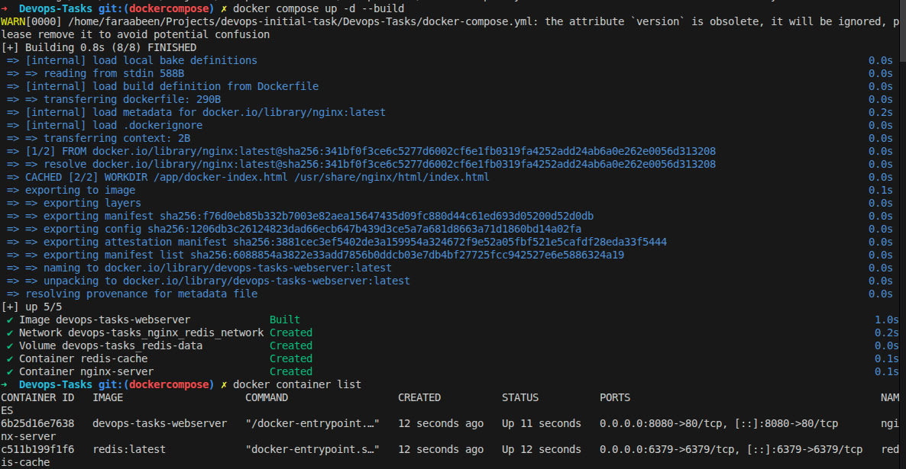
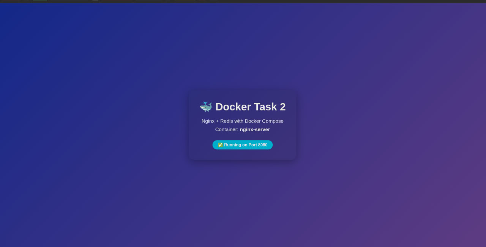

# 🐳 Docker Task 2: Nginx + Redis with Docker Compose

## 📋 Project Overview

This project demonstrates containerization using Docker and Docker Compose. It deploys a custom Nginx web server serving a static HTML page alongside a Redis cache service, both connected through a custom bridge network.

---

## 📁 Project Structure

```
Devops-Tasks/
├── Dockerfile              # Custom Nginx image configuration
├── docker-compose.yml      # Multi-container orchestration
├── docker-index.html       # Static HTML page
└── README.md              # This file
```

---

## 🚀 Quick Start

### Prerequisites

- Docker installed (version 20.10+)
- Docker Compose installed (version 2.0+)
- Basic understanding of command line

### Execution Steps

#### Step 1: Navigate to Project Directory

```bash
cd Devops-Tasks
```

#### Step 2: Build and Run Services

```bash
docker compose up -d --build
```

**What this does:**
- Builds the custom Nginx image from Dockerfile
- Pulls the Redis image from Docker Hub
- Creates network and volume
- Starts both containers in detached mode

#### Step 3: Verify Services Are Running

```bash
docker compose ps
```

Expected output:
```
NAME             IMAGE           STATUS
nginx-server     task-2-webserver   Up (healthy)
redis-cache      redis:latest        Up (healthy)
```

#### Step 4: Access the Web Server

Open your browser and navigate to:
```
http://localhost:8080
```

#### Step 5: Test Redis Connection

```bash
# Connect to Redis container
docker exec -it redis-cache redis-cli

# Test connection
ping
# Response: PONG

# Set a value
SET mykey "Hello from Docker"

# Get the value
GET mykey

# Exit
exit
```

#### Step 6: Stop Services

```bash
# Stop and remove containers (keeps volumes)
docker compose down

# Stop and remove everything including volumes
docker compose down -v
```

---

## 📸 Docker Compose Execution Screenshot



*Figure 1: Docker Compose building and starting Nginx + Redis services*


## 📸 Final Output



*Figure 2: Final Output*


---

## 📖 Commands and Switches Explained

### Docker Compose Commands

#### `docker compose up`

| Switch | Full Name | Description | Example |
|--------|-----------|-------------|---------|
| `-d` | `--detach` | Run containers in background (detached mode) | `docker compose up -d` |
| `--build` | `--build` | Force rebuild of images before starting | `docker compose up --build` |
| `-f` | `--file` | Specify alternate compose file | `docker compose -f docker-compose.prod.yml up` |

**Common Usage:**
```bash
# First time setup - build and run
docker compose up -d --build

# Subsequent runs - just start
docker compose up -d

# View logs in real-time
docker compose logs -f

# View logs for specific service
docker compose logs -f webserver
```

#### `docker compose down`

| Switch | Full Name | Description |
|--------|-----------|-------------|
| `-v` | `--volumes` | Remove named volumes declared in volumes section |
| `--rmi` | `--rmi` | Remove images (all or local) |
| `--remove-orphans` | `--remove-orphans` | Remove containers not defined in compose file |

**Common Usage:**
```bash
# Stop containers only
docker compose down

# Stop containers and remove volumes
docker compose down -v

# Complete cleanup
docker compose down -v --rmi all
```

#### `docker compose ps`

| Switch | Description |
|--------|-------------|
| `-q` | Only display IDs |
| `--services` | List service names only |
| `--filter` | Filter services by status |

#### `docker compose exec`

Execute command inside running container:
```bash
# Execute bash in webserver
docker compose exec webserver bash

# Execute redis-cli in redis
docker compose exec redis redis-cli
```

---

### Dockerfile Commands

| Command | Purpose | In This Project |
|---------|---------|-----------------|
| `FROM` | Specify base image | `FROM nginx:latest` |
| `WORKDIR` | Set working directory | Sets `/app` as workdir |
| `COPY` | Copy files to container | Copies HTML file |
| `EXPOSE` | Document port | `EXPOSE 80` |
| `CMD` | Default command | Runs Nginx in foreground |

---

### Docker Compose YAML Configuration

#### Services Configuration

**Webserver Service:**
```yaml
webserver:
  build: .                    # Build from Dockerfile in current directory
  container_name: nginx-server # Custom container name
  ports:
    - "8080:80"               # Map host port 8080 to container port 80
  restart: unless-stopped     # Restart policy
  networks:
    - nginx_redis_network     # Connect to custom network
  depends_on:
    - redis                   # Start redis first
```

**Redis Service:**
```yaml
redis:
  image: redis:latest         # Use official Redis image
  container_name: redis-cache # Custom container name
  ports:
    - "6379:6379"             # Expose Redis default port
  restart: unless-stopped     # Restart policy
  networks:
    - nginx_redis_network     # Connect to custom network
  volumes:
    - redis-data:/data        # Persistent storage
```

#### Network Configuration

```yaml
networks:
  nginx_redis_network:
    driver: bridge            # Bridge network for container communication
```

**Why Bridge Network?**
- Isolates containers from host network
- Allows containers to communicate by service name
- Provides DNS resolution between services

#### Volume Configuration

```yaml
volumes:
  redis-data:
    driver: local             # Local volume driver
```

**Why Volume?**
- Persists Redis data beyond container lifecycle
- Survives container removal and recreation
- Stored in Docker-managed location (`/var/lib/docker/volumes/`)

---

## 🔧 Key Configuration Details

### Port Mapping

```
Host Machine          Container
┌──────────┐         ┌──────────┐
│ Port 8080│ ─────→ │ Port 80  │  (Nginx)
└──────────         └──────────┘
┌──────────┐         ┌──────────
│ Port 6379│ ─────→ │ Port 6379│  (Redis)
└──────────┘         └──────────┘
```

**Access Points:**
- Web Server: `http://localhost:8080`
- Redis: `localhost:6379`

### Restart Policies

| Policy | Behavior |
|--------|----------|
| `no` | Never restart (default) |
| `always` | Always restart |
| `on-failure` | Restart only on failure |
| `unless-stopped` | Restart unless manually stopped ✅ |

**Why `unless-stopped`?**
- Automatically recovers from crashes
- Doesn't restart if you manually stop it
- Best for production environments

### Service Dependencies

```yaml
depends_on:
  - redis
```

**What it does:**
- Ensures Redis starts before webserver
- Does NOT wait for Redis to be ready
- For health-based dependencies, use `depends_on` with `condition: service_healthy`

---

##  Challenges and Solutions

### Challenge: YAML Syntax and Indentation

**Problem:**
YAML is extremely sensitive to indentation and spacing. Incorrect indentation causes parsing errors that can be difficult to debug.

**Common Issues Encountered:**

1. **Missing Space After Dash**
   ```yaml
   # ❌ Wrong
   ports:
     -"8080:80"
   
   # ✅ Correct
   ports:
     - "8080:80"
   ```

2. **Inconsistent Indentation**
   ```yaml
   # ❌ Wrong (mixing tabs and spaces)
   services:
     webserver:
       build: .
         ports:      # Wrong indentation level
           - "8080:80"
   
   # ✅ Correct (2 spaces per level)
   services:
     webserver:
       build: .
       ports:
         - "8080:80"
   ```

3. **Array vs Object Confusion**
   ```yaml
   # ❌ Wrong
   volumes:
     redis-data:/data    # Missing dash
   
   # ✅ Correct
   volumes:
     - redis-data:/data  # Array item with dash
   ```

4. **Volume Definition Location**
   ```yaml
   # ❌ Wrong - volumes not defined at root level
   services:
     redis:
       volumes:
         - redis-data:/data
   # Missing volumes: at root
   
   # ✅ Correct
   services:
     redis:
       volumes:
         - redis-data:/data
   
   volumes:              # Root level definition
     redis-data:
   ```

**Solutions Applied:**

1. **Used a YAML Linter**
   ```bash
   # Install yamllint
   pip install yamllint
   
   # Validate compose file
   yamllint docker-compose.yml
   ```

2. **Docker Compose Config Validation**
   ```bash
   # Check syntax before running
   docker compose config
   
   # This validates YAML and shows parsed configuration
   ```

3. **Consistent Editor Settings**
   - Configured VS Code to use 2 spaces for indentation
   - Enabled "Render Whitespace" to see tabs vs spaces
   - Installed YAML extension for syntax highlighting

4. **Incremental Testing**
   ```bash
   # Test with minimal config first
   version: '3.8'
   services:
     webserver:
       build: .
   
   # Gradually add features and validate
   docker compose config
   ```

**Lessons Learned:**
- ✅ Always use spaces, never tabs in YAML
- ✅ Maintain consistent 2-space indentation
- ✅ Use `docker compose config` to validate before running
- ✅ Arrays (lists) always start with `-`
- ✅ Root-level keys (`services`, `networks`, `volumes`) must not be indented
- ✅ YAML linters catch errors Docker might miss

---

## 🔍 Useful Commands Reference

### Container Management

```bash
# List running containers
docker ps

# List all containers (including stopped)
docker ps -a

# View container logs
docker logs nginx-server

# Follow logs in real-time
docker logs -f nginx-server

# Execute command in container
docker exec -it nginx-server bash

# Stop container
docker stop nginx-server

# Start container
docker start nginx-server

# Remove container
docker rm nginx-server
```

### Image Management

```bash
# List images
docker images

# Build image
docker build -t my-nginx .

# Remove image
docker rmi my-nginx

# Pull image
docker pull redis:latest
```

### Network Management

```bash
# List networks
docker network ls

# Inspect network
docker network inspect nginx_redis_network

# Remove network
docker network rm nginx_redis_network
```

---

## 📊 Architecture Diagram

```
┌─────────────────────────────────────────────────────────┐
│                     Host Machine                        │
│                                                         │
│  ┌─────────────────────────────────────────────────┐   │
│  │           Docker Compose Managed                │   │
│  │                                                 │   │
│  │  ┌─────────────────┐      ┌─────────────────┐  │   │
│  │  │   webserver     │      │     redis       │  │   │
│  │  │  (nginx-server) │      │  (redis-cache)  │  │   │
│  │  │                 │      │                 │  │   │
│  │  │  Port: 80       │      │  Port: 6379     │  │   │
│  │  │                 │      │                 │  │   │
│  │  │  +------------+ │      │  +------------+ │  │   │
│  │  │  │ index.html │ │      │  │   /data    │ │  │   │
│  │  │  +------------+ │      │  │ (persisted)│ │  │   │
│  │  └────────┬────────┘      └────────┬────────┘  │   │
│  │           │                        │            │   │
│  └───────────┼────────────────────────┼────────────┘   │
│              │                        │                │
│              └──────────┬─────────────┘                │
│                         │                              │
│              ┌──────────▼──────────┐                   │
│              │ nginx_redis_network │                   │
│              │   (bridge driver)   │                   │
│              └─────────────────────┘                   │
│                                                         │
│  External Access:                                       │
│  - http://localhost:8080  → webserver                  │
│  - localhost:6379         → redis                      │
└─────────────────────────────────────────────────────────┘
```

---

## ✅ Verification Checklist

After running `docker compose up -d --build`, verify:

- [ ] Both containers are running: `docker compose ps`
- [ ] Web server responds: `curl http://localhost:8080`
- [ ] Redis is accessible: `docker exec redis-cache redis-cli ping`
- [ ] Network created: `docker network ls | grep nginx_redis`
- [ ] Volume created: `docker volume ls | grep redis-data`
- [ ] No errors in logs: `docker compose logs`

---

## 🧹 Cleanup Commands

```bash
# Stop and remove containers, network
docker compose down

# Also remove volumes (data will be lost!)
docker compose down -v

# Also remove images
docker compose down -v --rmi all

# Remove everything Docker-related (careful!)
docker system prune -a --volumes
```

---

## 📚 Additional Resources

- **Docker Documentation:** https://docs.docker.com/
- **Docker Compose Reference:** https://docs.docker.com/compose/compose-file/
- **Nginx Docker Hub:** https://hub.docker.com/_/nginx
- **Redis Docker Hub:** https://hub.docker.com/_/redis
- **YAML Specification:** https://yaml.org/spec/

---

## 👨‍💻 Author

**Alireza Ardani**  
DevOps Engineer in Training  
Email: alireza.ardani.01@gmail.com  
GitHub: https://github.com/AlirezaArdani

---

## 📄 License

This project is created for educational purposes as part of DevOps training.

---

**Last Updated:** February 2026  
**Status:** ✅ Tested and Working